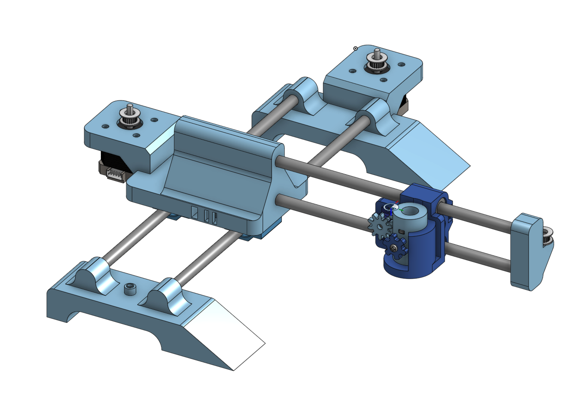
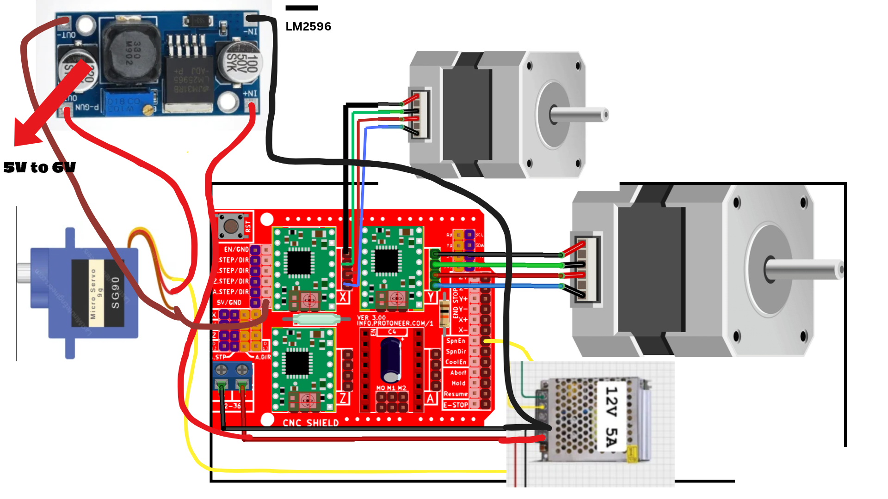

# Pen plotter

A simple a4 size pen plotter with arduino uno and cnc shield. Uses a fork of grbl for pen plotter using servo motor to lift the pen.

## Schematic

## CAD

onshape - [link](https://cad.onshape.com/documents/4c7f68aa2f461307f6d539b9/w/be013223c8f04b76fb331d8b/e/658f321bb1644bd8f7b4e9d1?renderMode=0&uiState=6abb5c381bd84db25bdf7de3)

## Firmware

Right now firmware is untested phase, I will update it after testing

Link to official Grbl_Pen_Servo - https://github.com/bdring/Grbl_Pen_Servo

### How to flash

- connect Uno
- clone the repo
- open arduino IDE and select arduino Uno as the board
- open cloned repo -> grbl -> examples -> grblUpload, in the IDE
- ctrl + R
- ctrl + U

## Bill of Materials

| Name | Qty |
|---|---|
| 3D Printed Parts | 1 set |
| Arduino Uno | 1 |
| CNC Shield V3 | 1 |
| A4988 Stepper Driver | 2 |
| NEMA 17 Stepper Motor | 2 |
| SG90 Servo | 1 |
| M5 Heat-Set Insert 10 mm | 11 |
| M5 Screw 30 mm | 11 |
| M2 Screw 12mm | 2 |
| M2 Nut | 2 |
| M3 Screw 8mm | 8 |
| M4 Screw 20mm | 1 |
| M4 Nut | 1 |
| 12 V 5 A DC Power Supply | 1 |
| LM2596 Buck Converter | 1 |
| GT2 Timing Belt ~10M | 1 |
| GT2 Timing Pulley, 20T | 2 |
| Idler Pulley | 2 |
| Linear Rod 10mm W, 350mm L | As required |
| LM10UU (cylinder only) | 2 |
| LM10UU Block/Slide unit | 2 |
| Servo Extension Cable, 3-pin | 1 |
| Dupont Jumper Wires | 1 set |
| 2-core Wire for Stepper Motors ~2m | 1 |
| 2-core Power Wire ~1m | 1 |
| 3-core Wire for Servo ~1m | 1 |
| DC Barrel Connector | 1 |
| DC Power Switch | 1 |
| Heat-shrink Tubing | 1 set |
| Cable Ties | 1 pack |
| Cable Sleeve | 1 |